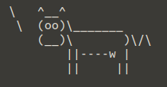

# Unofficial Course Content Index (UCCI)
This is the Unofficial Course Content Index (from now on, 'UCCI') of the online sessions of the Python Specialization Course that took place from April to July, 2020.

* [To Consider](#to-consider)
* [Core](#core)
* [Employability](#emp)
* [Libraries](#libs)
* [Design Patterns](#patterns)
* [Web Development](#web)
* [System Administration](#sys-admin)
* [Desktop Apps](#desktop-apps)
* [Data Science](#data)
* [Internet of Things](#iot)
* [Videogames](#videogames)
* [Testing](#testing)

## To Consider
The following are the icons included throughout the UCCI:

- :beginner: - Link to the notes of the official repository, written in Spanish :es:
- :page_with_curl: - Link to information on Wikipedia
- :orange_book: - Link to official documentation
- :es: - Link to Spanish content
- :us: - Link to English content
- :top: - Back to file index

**Also:**

- *(XX:XX - XX:XX:XX)* - This refers to the timeframes of the recorded session of the course
- If not specified, the link to Wikipedia, books or any other content will be in English.

# Core :abc:
## :abc: Friday, April 3rd

### Content
#### Review of the Past Classes
(12:30 - 01:10:55)
- Datatypes [:beginner:](https://github.com/pythoncanarias/eoi/blob/master/02-core/01-data/01-data.ipynb)
    - numbers [:beginner:](https://github.com/pythoncanarias/eoi/blob/master/02-core/02-numbers/02-numbers.ipynb)
    - string [:beginner:](https://github.com/pythoncanarias/eoi/blob/master/02-core/03-strings/03-strings.ipynb)
    - lists and tuples [:beginner:](https://github.com/pythoncanarias/eoi/blob/master/02-core/06-lists/06-lists.ipynb)
    - dicts and sets [:beginner:](https://github.com/pythoncanarias/eoi/blob/master/02-core/07-dicts/07-dicts.ipynb)
- Conditionals [:beginner:](https://github.com/pythoncanarias/eoi/blob/master/02-core/04-conditionals/04-conditionals.ipynb)
- Loops [:beginner:](https://github.com/pythoncanarias/eoi/blob/master/02-core/05-loops/05-loops.ipynb)

#### Functions [:beginner:](https://github.com/pythoncanarias/eoi/blob/master/02-core/08-functions/08-functions.ipynb)
(01:11:20 - 04:00:00)
- What Do I Need Them for?
- Arguments and Parameters
- Docstrings
- Functions Are Also Objects
- Inner Functions
- Lambda Functions
- Generators
- Recursion
- Error Exceptions

[:top:](#top)

## :abc: Monday, April 6th

### Content
#### Objects and Classes [:beginner:](https://github.com/pythoncanarias/eoi/blob/master/02-core/09-objects/09-objects.ipynb)
(18:00 - 04:00:00)
- What Are Objects? (18:00 - 01:35:00)
- Inheritance (01:35:05 - 03:40:00)
- Accessing Attributes (03:40:35 - 04:00:00)

[:top:](#top)

## :abc: Tuesday, April 7th

### Content
#### Objects and Classes [:beginner:](https://github.com/pythoncanarias/eoi/blob/master/02-core/09-objects/09-objects.ipynb)
- Object-Oriented Programming (05:00 - 03:18:00)

#### File Handling [:beginner:](https://github.com/pythoncanarias/eoi/blob/master/02-core/10-files/10-files.ipynb)
(03:23:00 - 04:01:15)
- Open and Create Files
- Write Files
- Read Files

[:top:](#top)

## :abc: Wednesday, April 8th

### Content
#### File Handling [:beginner:](https://github.com/pythoncanarias/eoi/blob/master/02-core/10-files/10-files.ipynb)
(01:30 - 02:38:40)
- Close Files Automatically
- Iterate Files
- **Import** Modules (01:27:30 - 01:44:20)
- How to Organize a Script on Python (01:44:25 - 02:38:40)
    - sys.argv
- Project (02:39:00 - 03:03:03)

[:top:](#top)

# Employability :necktie:
## :necktie: Monday, April 13th

[:top:](#top)

## :necktie: Thursday, May 7th (from 5 to 8 pm)

[:top:](#top)

## :necktie: Monday, May 18th

[:top:](#top)

## :necktie: Wednesday, June 3rd

[:top:](#top)

# Libraries :aerial_tramway:
## :aerial_tramway: Tuesday, April 14th

### Content
#### Standard libraries

- **os** [:beginner:](https://github.com/pythoncanarias/eoi/blob/master/05-libs/standard/os/os.ipynb) [:orange_book:](https://docs.python.org/3/library/os.html) (05:40 - 01:30:10) *(Miscellaneous operating system interfaces)*
    - path
    - name
    - listdir()
    - walk()

- **sys** [:beginner:](https://github.com/pythoncanarias/eoi/blob/master/05-libs/standard/sys/sys.ipynb) [:orange_book:](https://docs.python.org/3/library/sys.html?highlight=sys#module-sys) (01:31:10 - 01:55:50) *(System-specific parameters and functions)*
    - argv
    - exc_info()
    - path
    - version
    - platform

- **zlib** [:beginner:](https://github.com/pythoncanarias/eoi/blob/master/05-libs/standard/zlib/zlib.ipynb) [:orange_book:](https://docs.python.org/3/library/zlib.html?highlight=zlib#module-zlib) (01:57:25 - 03:00:00) *(Compression and decompression)*
    - compress
    - decompress
    - checksums
        - adler32
	    - crc32

- **gzip** [:beginner:](https://github.com/pythoncanarias/eoi/blob/master/05-libs/standard/gzip/gzip.ipynb) [:orange_book:](https://docs.python.org/3/library/gzip.html?highlight=gzip#module-gzip) (03:11:40 – 03:49:50) *(Compression and decompression)*
    - open
    - writelines()

[:top:](#top)

## :aerial_tramway: Wednesday, April 15th

### Content
#### Standard libraries
- **zipfile** [:beginner:](https://github.com/pythoncanarias/eoi/blob/master/05-libs/standard/zipfile/zipfile.ipynb) [:orange_book:](https://docs.python.org/3/library/zipfile.html?highlight=zipfile#module-zipfile) (01:00 – 42:20) *(Compression and decompression of ZIP archives)*
    - is_zipfile()
    - ZipFile class
        - getinfo(name)
        - extract(member, path=None, pwd=None)
        - extractall(path=None, members=None, pwd=None)
        - printdir()
        - setpassword(pwd)
        - read(name, pwd=None)
        - testzip()
        - write (filename, arcname=None, compress_type=None, compresslevel=None)
        - writestr (zinfo_or_arcname, data, compress_type=None, compresslevel=None)

- **time** [:beginner:](https://github.com/pythoncanarias/eoi/blob/master/05-libs/standard/time/time.ipynb) [:orange_book:](https://docs.python.org/3/library/time.html?highlight=time#module-time) (01:35:40 – 02:22:30) *(Time access and conversions)*
    - definitions
    - time()
    - asctime()
    - localtime()
    - gmtime()
    - mktime()

- **datetime** [:beginner:](https://github.com/pythoncanarias/eoi/blob/master/05-libs/standard/datetime/datetime.ipynb) [:orange_book:](https://docs.python.org/3/library/datetime.html?highlight=datetime#module-datetime) (02:25:10 – 03:17:45) *(Basic date and time types)*
    - date
        - today, day, month, year
        - fromtimestamp
    - .datetime
        - now()
        - minute, year…

- **base64** [:beginner:](https://github.com/pythoncanarias/eoi/blob/master/05-libs/standard/base64/base64.ipynb) [:orange_book:](https://docs.python.org/3/library/base64.html?highlight=base64#module-base64) (03:23:40 – 04:00:00) *(Data encodings)* *(part I)*
    - what econding is and what is not
    - b64encode
    - decode

[:top:](#top)

## :aerial_tramway: Thursday, April 16th

### Content
#### Standard libraries
- **base64** [:beginner:](https://github.com/pythoncanarias/eoi/blob/master/05-libs/standard/base64/base64.ipynb) [:orange_book:](https://docs.python.org/3/library/base64.html?highlight=base64#module-base64) (04:00 - 16:00) *(Data encodings)* *(part II)*
    - HTML module

- **statistics** [:beginner:](https://github.com/pythoncanarias/eoi/blob/master/05-libs/standard/statistics/statistics.ipynb) [:orange_book:](https://docs.python.org/3/library/statistics.html?highlight=statistics#module-statistics) (16:40 – 01:19:20) *(Mathematical statistics functions)*
    - mean
    - geometric_mean
    - median
    - mode
    - stdev & variance

- **collections** [:beginner:](https://github.com/pythoncanarias/eoi/blob/master/05-libs/standard/collections/collections.ipynb) [:orange_book:](https://docs.python.org/3/library/collections.html?highlight=collections#module-collections) (01:32:35 – 02:32:20) *(Container datatypes)*
    - namedtuple
    - deque
    - Counter
    - OrderedDict
    - defaultdict

- **csv** [:beginner:](https://github.com/pythoncanarias/eoi/blob/master/05-libs/standard/csv/csv.ipynb) [:orange_book:](https://docs.python.org/3/library/csv.html?highlight=csv#module-csv) (02:32:40 – 02:58:15) *(CSV file reading and writing)*
    - reader
    - writer

- **re** [:beginner:](https://github.com/pythoncanarias/eoi/blob/master/05-libs/standard/re/re.ipynb) [:orange_book:](https://docs.python.org/3/library/re.html?highlight=re#module-re) (03:20:40 – 04:00:00) *(Regular expression operations)* *(part I)*
    - compile

[:top:](#top)

## :aerial_tramway: Friday, April 17th

### Content
#### Standard libraries
- **re** [:beginner:](https://github.com/pythoncanarias/eoi/blob/master/05-libs/standard/re/re.ipynb) [:orange_book:](https://docs.python.org/3/library/re.html?highlight=re#module-re) (02:45 - 01:29:40) *(Regular expression operations)* *(part II)*
    - special characters
        - ^
        - ?
        - [ & ]
        - |
        - { & }
        -  \
        - \b & \B
        - \d & \D
        - \s & \S
        - \w
        - ( & )
    - search, match & findall

- **logging** [:beginner:](https://github.com/pythoncanarias/eoi/blob/master/05-libs/standard/logging/logging.ipynb) [:orange_book:](https://docs.python.org/3/library/logging.html?highlight=logging#module-logging) (01:41:40 – 02:38:35) *(Logging facility for Python)*
    - debug()
    - info()
    - warning()
    - error()
    - critical()

- **pdb** [:beginner:](https://github.com/pythoncanarias/eoi/blob/master/05-libs/standard/pdb/pdb.ipynb) [:orange_book:](https://docs.python.org/3/library/pdb.html?highlight=pdb#module-pdb) (02:40:00 – 03:04:00) *(The Python debugger)*
    - list
    - help
    - where
    - step
    - next
    - return

- **threading** [:beginner:](https://github.com/pythoncanarias/eoi/blob/master/05-libs/standard/threading/threading.ipynb) [:orange_book:](https://docs.python.org/3/library/threading.html?highlight=threading#module-threading) (03:20:45 – 03:59:20) *(Thread-based parallelism)*

[:top:](#top)

## :aerial_tramway: Monday, April 20th

### Content
#### External libraries
- **arrow** [:beginner:](https://github.com/pythoncanarias/eoi/blob/master/05-libs/external/arrow/arrow.ipynb) [:orange_book:](https://pypi.org/project/arrow/) (03:30 – 01:30:15) *(Create, manipulate, format and convert dates, times and timestamps)*
    - get
    - utcnow
        - span
    - now
        - utccoffset()
        - shift()
    - replace

#### Standard libraries
- **random** [:beginner:](https://github.com/pythoncanarias/eoi/blob/master/05-libs/standard/random/random.ipynb) [:orange_book:](https://docs.python.org/3/library/random.html?highlight=random#module-random) (01:53:25 – 03:30:10) *(Generate pseudo-random numbers)*
    - random()
    - choice()
    - seed()
    - choices()
        - cum_weights
    - sample()
    - randrange()
    - randint()
    - shuffle()
    - uniform()
    - paretovariate()
    - gauss()

#### External libraries
- **matplotlib** [:beginner:](https://github.com/pythoncanarias/eoi/blob/master/05-libs/external/matplotlib/matplotlib.ipynb) [:orange_book:](https://matplotlib.org/3.2.1/contents.html) (03:30:30 – 04:02:40) *(Data visualization tool)* (part I)
    - plot
    - bar
    - hist
    - barh
    - scatter

[:top:](#top)

## :aerial_tramway: Tuesday, April 21st

### Content
#### External libraries
- **matplotlib** [:beginner:](https://github.com/pythoncanarias/eoi/blob/master/05-libs/external/matplotlib/matplotlib.ipynb) [:orange_book:](https://matplotlib.org/3.2.1/contents.html) (28:20 – 01:08:40) *(Data visualization tool)* (part II)
    - title
    - text
    - xlabel
    - ylabel

- **requests** [:beginner:](https://github.com/pythoncanarias/eoi/blob/master/05-libs/external/requests/requests.ipynb) [:orange_book:](https://requests.readthedocs.io/en/master/) (02:05:30 – 04:00:30) *(HTTP library for Python)*
    - get
        - status_code
        - headers
        - text
        - json()
        - url
        - history
        - cookies
    - post
    - put
    - delete
    - head
    - options
    - Session()

[:top:](#top)

## :aerial_tramway: Wednesday, April 22nd

### Content
#### Standard libraries
- **json** [:beginner:](https://github.com/pythoncanarias/eoi/blob/master/05-libs/standard/json/json.ipynb) [:orange_book:](https://docs.python.org/3/library/json.html?highlight=json#module-json) (05:30 – 56:00) *(JSON encoder and decoder)*
    - dumps
    - Public APIs *(Application Programming Interface)*

#### External libraries
- **pillow** [:beginner:](https://github.com/pythoncanarias/eoi/blob/master/05-libs/external/pillow/pillow.ipynb) [:orange_book:](https://pillow.readthedocs.io/en/stable/) (02:01:17 – 04:01:05) *(Support for opening, manipulating and saving images)* *(part I)*
    - format, size y mode
    - open
    - save
    - thumbnail
    - crop
    - transpose
    - paste
    - split
    - merge
    - resize

[:top:](#top)

## :aerial_tramway: Thursday, April 23rd

#### External libraries
### Content
- **pillow** [:beginner:](https://github.com/pythoncanarias/eoi/blob/master/05-libs/external/pillow/pillow.ipynb) [:orange_book:](https://pillow.readthedocs.io/en/stable/) (08:00 – 02:27:50) *(Support for opening, manipulating and saving images)* *(part II)*
    - rotate
    - convert
    - ImageFilter()
        - BLUR
        - CONTOUR
        - DETAIL
        - …
    - point
    - ImageEnhance
        - Color
        - Contrast
        - Brightness
        - Sharpness
    - ImageDraw
      - Draw
      - arc
      - pieslice
      - polygon
      - rectangle
      - text
      - textsize
      - floodfill
      - ellipse
    - getpixel
    - putpixel
    - load()
    - Image.new()
    - paste

- **numpy** [:beginner:](https://github.com/pythoncanarias/eoi/blob/master/05-libs/external/numpy/numpy.ipynb) [:orange_book:](https://numpy.org/doc/) (02:29:20 – 03:43:00) *(Scientific computing with Python)*
    - array
    - dtype
    - reshape
    - zeros
    - linspace
    - random
        - rand
    - cos

- **Project:** Backup script

[:top:](#top)

## :aerial_tramway: Friday, April 24th

### Content
#### External libraries
- **pandas** [:beginner:](https://github.com/pythoncanarias/eoi/blob/master/05-libs/external/pandas/pandas.ipynb) [:orange_book:](https://pandas.pydata.org/docs/) (05:20 - 02:25:10) *(Data structures and data analysis tools for Python)*
    - read_csv()
    - to_numeric()

- **qrcode** [:beginner:](https://github.com/pythoncanarias/eoi/blob/master/05-libs/external/qrcode/qrcode.ipynb) [:orange_book:](https://pypi.org/project/qrcode/) (02:25:40 – 02.58:15) *(QR code generator)*

- **Links of interest** (02:59:00 – 03:05:00):
    - [Github Trendings](https://github.com/trending/python) (practice Python on GitHub)
    - [Awesome Python repository](https://github.com/vinta/awesome-python)

- **watchdog** [:beginner:](https://github.com/pythoncanarias/eoi/blob/master/05-libs/external/watchdog/watchdog.ipynb) [:orange_book:](https://pythonhosted.org/watchdog/) (03:06:30 – 03:55:00) *(File system events monitor)*
    - Observer()
        - schedule
        - stop
        - join

[:top:](#top)

# Design Patterns :wrench:
## :wrench: Monday, April 27th

### Content
- **Introduction** [:beginner:](https://github.com/pythoncanarias/eoi/blob/master/04-patterns/00-Introduction.ipynb) (04:00 - 02:00:50)
    - Definition [:page_with_curl:](https://en.wikipedia.org/wiki/Software_design_pattern)
    - History
    - Book: [Design Patterns: Elements of Reusable Object-Oriented Software](https://en.wikipedia.org/wiki/Design_Patterns)
    - Types of patterns
    - Design principles
    - How not to use the design patterns

- **Singleton** [:beginner:](https://github.com/pythoncanarias/eoi/blob/master/04-patterns/01-Singleton.ipynb) [:page_with_curl:](https://en.wikipedia.org/wiki/Singleton_pattern) (02:02:02 - 02:50:30)

- **Prototype** [:beginner:](https://github.com/pythoncanarias/eoi/blob/master/04-patterns/01-Singleton.ipynb) [:page_with_curl:](https://en.wikipedia.org/wiki/Prototype_pattern) (02:50:45 - 03:25:15)

- **Factory Method** [:beginner:](https://github.com/pythoncanarias/eoi/blob/master/04-patterns/03-Factory.ipynb) [:page_with_curl:](https://en.wikipedia.org/wiki/Factory_method_pattern) (03:25:30 - 03:44:50)

- **Builder** [:beginner:](https://github.com/pythoncanarias/eoi/blob/master/04-patterns/04-Builder.ipynb) [:page_with_curl:](https://en.wikipedia.org/wiki/Builder_pattern) (03:46:50 - 03:57:30)

[:top:](#top)

## :wrench: Tuesday, April 28th

### Content
- **Adapter** [:beginner:](https://github.com/pythoncanarias/eoi/blob/master/04-patterns/05_Adapter.ipynb) [:page_with_curl:](https://en.wikipedia.org/wiki/Adapter_pattern) (07:49 - 38:15)

- **Bridge** [:beginner:](https://github.com/pythoncanarias/eoi/blob/master/04-patterns/06-Bridge.ipynb) [:page_with_curl:](https://en.wikipedia.org/wiki/Bridge_pattern) (38:20 - 01:32:50)

- **Façade** [:beginner:](https://github.com/pythoncanarias/eoi/blob/master/04-patterns/09-Facade.ipynb) [:page_with_curl:](https://en.wikipedia.org/wiki/Facade_pattern) (01:56:00 - 02:28:05)

- **Flyweight** [:beginner:](https://github.com/pythoncanarias/eoi/blob/master/04-patterns/10-Flyweight.ipynb) [:page_with_curl:](https://en.wikipedia.org/wiki/Flyweight_pattern) (02:28:20 - 03:02:05)

- **Strategy** [:beginner:](https://github.com/pythoncanarias/eoi/blob/master/04-patterns/12-Strategy.ipynb) [:page_with_curl:](https://en.wikipedia.org/wiki/Strategy_pattern) (03:18:25 - 04:01:30)

[:top:](#top)

# Web Development :globe_with_meridians:
## :globe_with_meridians: Wednesday, April 29th

[:top:](#top)

## :globe_with_meridians: Thursday, April 30th

[:top:](#top)

## :globe_with_meridians: Monday, May 4th

[:top:](#top)

## :globe_with_meridians: Tuesday, May 5th

[:top:](#top)

## :globe_with_meridians: Wednesday, May 6th

[:top:](#top)

## :globe_with_meridians: Thursday, May 7th (from 4 to 5 pm)

[:top:](#top)

# System Administration :cloud:
## :cloud: Friday, May 8th

### Content
- **Hardware** (25:00 - 01:31:00)
    - Central Processing Unit
    - Random-Access Memory
    - Hard Disk Drive
    - Net
- **Software Information** (01:33:20 - 03:24:00)
    - lscpu
    - uptime
    - htop
    - free
    - lsblk
- **File System Permissions** (03:24:15 - 03:54:00)
    - chmod
    - chown
    - chgrp
- **Installing Virtual Box** (03:59:50 - 04:04:00)

[:top:](#top)

## :cloud: Monday, May 11th

### Content

- **Installing Virtual Box** (10:00 - 52:00)
- **What Is The OSI Model?** (53:58 - 04:00:00)
    - Physical Layer
    - Data Link Layer
        - MAC (01:10:35 - 01:26:30)
    - Network Layer
        - IP (01:28:10 - 03:29:00)
        - NAT (03:29:35 - 03:38:00)
    - Transport Layer
        - Ports (03:39:45 - 04:00:00)
            - TCP
            - UDP
    - Session Layer
    - Presentation Layer
    - Application Layer

[:top:](#top)

## :cloud: Tuesday, May 12th
#### Link to the... OH, WAIT

[:top:](#top)

## :cloud: Wednesday, May 13th

### Content

- **May 12th Review**
    - Connecting to remote machine
        - bridge, ping, host
        - networking
    - The OSI Model (08:00 - )
        - Application Layer
            - DNS Protocol (12:30 - 19:30)
                - dig 
                - RR (Resource Records)
            - HTTP (20:40 - 43:05)

- **How Do Requests Work?** (43:10 - 03:29:00)
    - socket [:page_with_curl:](https://docs.python.org/3/library/socket.html) (1:01:40 - 03:29:00) *(Access provider to the BSD socket interface in Python)*
    - psutil [:page_with_curl:](https://psutil.readthedocs.io/en/latest/) (03:30:00 - 04:00:00) *(Retrieving information on running processes and system utilization (CPU, memory, disks, network, sensors) in Python)*

[:top:](#top)

## :cloud: Thursday, May 14th

### Content

- **Client/Server Activity** (15:00 - 03:00:00)
    - ngrok (36:00 - 48:00)
    - client.py and server.py
- **How to Connect to a Remote Server through SSH** (03:09:30 - 04:00:00)
    - ssh remote-user@remote-ip
    - fabric [:page_with_curl:](http://www.fabfile.org/) (03:15:00 - 03:31:30) *(Execute shell commands remotely over SSH, yielding useful Python objects in return)*
        - Connection 
    - SSH Keys (03:33:00 - 04:00:00)

[:top:](#top)

## :cloud: Friday, May 15th

### Content

- **Review SSH** (09:00 - 25:45)
- **Working with Fabric** (30:00 - 01:43:20)
    - invoke and paramIT
    - getpass
- **Installing Shield on Remote Machine** (01:44:00 - 02:04:40)
- **How Does Our Server Work Internally?** (02:12:50 - 02:49:00)
    - Common Gateway Interface (CGI)
    - Web Server Gateway Interface (WSGI)
    - nginx
- **Project Configuration on The Server** (03:06:00 - 04:00:00)

[:top:](#top)

## :cloud: Tuesday, May 19th

### Content

- **How Does Nginx Work?** (01:50 - 16:00)
- **Trying uWSGI** (23:20 - 58:00)
- **Installing NGINX** (58:05 - 01:29:30)
    - mysite_nginx.conf/shield.conf (01:33:16 - 01:40:30) *(Configuration of the server)*
        - upstream
            - server_name
            - locations
    - Project configuration (01:30:00 - 03:23:00)
        - collectstatic
        - **More about:** nginx and uwsgi ~ File Permissions (03:00:00 - 03:23:00)
    - Configuring mysite_uwsgi.ini file

[:top:](#top)

## :cloud: Wednesday, May 20th

### Content

- **Finishig Details** (13:00 - 01:51:10)
- **Ansible** (02:25:00 - 04:02:00)
    - Installation (02:41:00 - 02:43:00)
    - Concepts (02:43:20 - 02:47:55)
        - Control Node and Nodes
        - Inventory File
        - Playbook
            - What Is a Playbook? (02:48:00 - 02:54:00)
                - Tasks
                - Role: Playbook Set
    - Starting The Project (02:54:00 - 03:30:00)
        - Add IP to /etc/ansible/hosts
        - ping [:page_with_curl:](https://docs.ansible.com/ansible/latest/modules/ping_module.html)
            - ansible all -m ping -u username
            - ssh-copy-id -i ~/.ssh/mykey user@host *(remember to run ssh-keygen first in order to have a new key to connect with)*
            - [yourmachine:vars]
        ansible_python_interpreter=/usr/bin/python3
        - **Controlling Nodes** ansible all -a 'apt update' -u username -b -K/--ask-become-pass (03:35:00 - 03:40:00)
        - service [:page_with_curl:](https://docs.ansible.com/ansible/latest/modules/service_module.html)
            - name (wpa_supplicant)
            - state (stopped/started/restarted/reloaded)
        - apt [:page_with_curl:](https://docs.ansible.com/ansible/latest/modules/apt_module.html)
            - name
            - update_cache
            - state

[:top:](#top)

## :cloud: Thursday, May 21st (from 16 to 19)

### Content
- **Ansible** (37:10 - 03:09:20)
    - Playbook
        - JSON [:page_with_curl:](https://www.json.org/json-en.html)
            - Datatypes
                - number
                - string
                - null
                - boolean
                - object
                - array
        - YAML [:page_with_curl:](https://yaml.org/spec/1.2/spec.html) (46:00 - 01:44:40) *(Yet Another Markup Language)*
            - Indentation -> Two spaces
            - Datatypes
                - dict -> key: value
                - number: 456
                - list:
                    - one
                    - two
                    - three
                - object: 
                    - key:
                        - one
                        - two
                        - three
                        number: 234
                        something: "hehe"
            - jq *(validation and formatting)*
            - yq *(transform YAML file to JSON and give to jq)*
        - First Play: **nginx_install.yaml** (01:45:00 - 02:01:20)
            - hosts (Whom)
            - tasks (Playbooks)
                - **(1)**
                    - task_name
                    - module
                        - parameters
                - **(2)**
                    - task_name
                    - module
                        - parameters
            - ansible-playbook
            - **IMPORTANT** (01:54:20 - 01:54:45)
                - install :cow: **cowsay** :cow2: [:page_with_curl:](https://en.wikipedia.org/wiki/Cowsay)
                - 
            - ansible-lint (02:24:30 - 02:26:20)
            - change nginx welcome page (02:28:10 - 02:46:00)
                - copy [:page_with_curl:](https://docs.ansible.com/ansible/latest/modules/copy_module.html#copy-module) (02:28:10 - 02:41:30)
            - playbooks (02:46:30 - 03:09:20)
                - install nginx (apt)
                - install uwsgi (pip)
                - clone shield project (git)
                - replace /etc/ssh/sshd_config

[:top:](#top)

# Desktop Apps :computer:
## :computer: Thursday, May 21st (from 19 to 20)

### Content
- Introduction (03:09:20 - 04:00:00)
    - Multiplatform
        - QT
        - GTK
    - Installation in venv
        - python3 -m venv graphics-env
        - pip3 install --upgrade pip
        - PyQt5
        - PySide2

[:top:](#top)

## :computer: Friday, May 22nd

### Content
- **Qt for Python** [:page_with_curl:](https://doc.qt.io/qtforpython/) (48:00 - 04:02:00)
    - Qt init
    - Signals and slots
    - PyQt5
    - Widgets
        - QMainWindow()
            - Menu Bar
            - Status Bar
            - Toolbars
            - Dock Widgets
            - Central Widget

[:top:](#top)

## :computer: Monday, May 25th

### Content
- Qt 
    - First half (00:03:00 - 02:00:00)
        - Review
        - QKeySecuence
        - How to dive into the documentation
        - QAction
        - Slots
        - QWidgetClass
        - QMessageBox
            - StandardButtons
            - Binary numbers
    - Second half (02:10:00 - 03:23:30)
        - closeEvent
        - QMainWindow inheritance (MyMainWindow)
        - QMessageBox (message before closing)

[:top:](#top)

## :computer: Tuesday, May 26th

### Content
- Qt
    - setDefaultFont (08:30 - 23:30)
    - **fbs** ~ app packing and running [:page_with_curl:](https://github.com/mherrmann/fbs-tutorial) (24:00 - )
        - startproject
        - your app --> main.py
            - appctxt = ApplicationContext()
            - appctxt.app.exec()
        - run
        - freeze
        - in case no fpm:
            - apt-get install ruby ruby-dev rubygems build-essential
            - gem install --no-document fpm
        - installer
    - QTree (01:32:45 - 04:00:00)

[:top:](#top)

## :computer: Wednesday, May 27th (from 4 to 7 pm)

### Content
- **Kivy** [:page_with_curl:](https://kivy.org/doc/stable/)(00:07 - 02:40:00) *(Open source software for the rapid development of applications equipped with novel user interfaces, such as multi-touch apps)*

[:top:](#top)

# Data Science :bar_chart:
## :bar_chart: Wednesday, May 27th (from 7 to 8 pm)

### Book
- [Python Data Science Handbook](jakevdp.github.io/PythonDataScienceHandbook)

### Content
- #### IPython: Beyond Normal Python [:page_with_curl:](https://jakevdp.github.io/PythonDataScienceHandbook/01.00-ipython-beyond-normal-python.html) (02:48:00 - 03:56:00)
    - Help and Documentation in IPython:
	- ?
	- TAB
	- dir(library)
	- globals(), locals()
	- **Built-in Functions in Python** [:page_with_curl:](https://docs.python.org/3/library/functions.html)
    - Keyboard Shortcuts
	- Standard Shortcuts (03:01:35 - 03:05:30)
	    - CTRL + A (go to bol)
	    - CTRL + K 
	    - CTRL + E (go to eol)
	    - CTRL + U
	- [installing vim commands on IPython](stackoverflow.com/a/38329940/1911099) (03:06:30 - 03:19:15)
    - Magic Commands
	- timeit (03:27:00 - 03:33:00)
	- ½lsmagic (03:33:25 - 03:35:00)
    - Input and Output (03:35:50 - 03:48:30)
        - In[x] and Out[x]
    - **Create a jupyter notebook** (03:49:00 - 03:53:40): %notebook filename.ipynb

[:top:](#top)

## :bar_chart: Thursday, May 28th

### Content
- #### IPython: Beyond Normal Python [:page_with_curl:](https://jakevdp.github.io/PythonDataScienceHandbook/01.00-ipython-beyond-normal-python.html) (04:50 - 01:08:00)
    - **IPython and Shell Commands** (04:50 - 01:08:00)
	    - Shell Commands in IPython
	        - ! (05:40 - 14:10)
	    - Shell-Related **Magic Commands**
	        - %cd (14:20 - 16:50)
        - Errors and Debugging (17:00 - 52:15)
	        - Controlling Exceptions
        - Profiling and Timing Code (52:25 - 01:08:00)
            - Profiling Full Scripts: **%prun** (54:20 - 58:25)
            - Line-by-Line Profiling with **%lprun** (58:25 - 01:03:10)
            - Profiling Memory Use: **%memit** and **%mprun** (01:03:15 - 01:08:00)
        - More IPython Resources

- #### Introduction to NumPy [:page_with_curl:](https://jakevdp.github.io/PythonDataScienceHandbook/02.00-introduction-to-numpy.html) (01:08:05 - 03:57:10)
    - **Understanding Data Types in Python** (01:11:50 - 02:18:05)
        - A Python Integer Is More Than Just an Integer (01:27:25 - 01:28:30)
        - A Python List Is More Than Just a List (01:28:40 - 01:30:48)
        - Fixed-Type Arrays in Python
        - Creating Arrays from Python Lists (01:31:15 - 01:44:00)
            - np.array()
        - Creating Arrays from Scratch (01:44:00 - 01:58:15)
        - NumPy Standard Data Types (02:06:00 - 02:18:05)

    - **The Basics of NumPy Arrays** (02:18:05 - 02:39:30)
        - NumPy Array Attributes (02:18:05 - 02:22:15)
        - Array Indexing: Accessing Single Elements (02:22:15 - 02:25:35)
        - Array Slicing: Accessing Subarrays (02:25:35 - 02:39:30)
            - One-dimensional subarrays
            - Multi-dimensional subarrays
            - Subarrays as no-copy views
            - Creating copies of arrays
        - **Reshaping of Arrays** (02:39:30 - 02:44:05)
            - np.arange(10) + np.arange(10).reshape((5,2))
        - Array Concatenation and Splitting (02:44:05 - 02:56:25)
            - Concatenation of arrays
            - Splitting of arrays

    - **Computation on NumPy Arrays: Universal Functions** (02:56:30 - 03:34:10)
        - The Slowness of Loops
        - Introducing UFuncs
        - Exploring NumPy's UFuncs (03:06:20 - 03:16:00)
            - Array arithmetic
            - Absolute value
            - Trigonometric functions
            - Exponents and logarithms
            - Specialized ufuncs
        - Advanced Ufunc Features (03:16:00 - 03:34:10)
            - Specifying output (03:16:00 - 03:20:00)
            - Aggregates (03:20:00 - 03:33:05)
            - Outer products (03:33:05 - 03:34:10)
        - Ufuncs: Learning More

    - **Aggregations: Min, Max, and Everything In Between** (03:34:15 - 03:57:10)
        - Summing the Values in an Array (03:35:30 - 03:38:45)
        - Minimum and Maximum (03:38:45 - 03:48:25)
            - Multi dimensional aggregates
            - Other aggregation functions
        - Example: What is the Average Height of US Presidents? (03:48:30 - 03:57:10)
            - **Manage data and csv files with numpy and pandas**

[:top:](#top)

## :bar_chart: Friday, May 29th

### Content
- #### Introduction to NumPy [:page_with_curl:](https://jakevdp.github.io/PythonDataScienceHandbook/02.00-introduction-to-numpy.html) (00:20 - )
    - **Aggregations: Min, Max, and Everything In Between** (00:20 - 07:20)
        - Example: What is the Average Height of US Presidents? (00:20 - 07:20)
            - Plotting data with seaborn and matplotlib

    - **Computation on Arrays: Broadcasting** (29:50 - 01:27:50)
        - Introducing Broadcasting (29:50 - 01:02:45)
        - Rules of Broadcasting (01:02:50 - 01:17:35)
        - Broadcasting in Practice (01:17:45 - 01:27:50)
            - Centering an array
            - Plotting a two-dimensional function

[:top:](#top)

## :bar_chart: Monday, June 1st

[:top:](#top)

## :bar_chart: Tuesday, June 2nd

[:top:](#top)

## :bar_chart: Thursday, June 4th

[:top:](#top)

## :bar_chart: Friday, June 5th

[:top:](#top)

## :bar_chart: Monday, June 8th

[:top:](#top)

## :bar_chart: Tuesday, June 9th

[:top:](#top)

## :bar_chart: Wednesday, June 10th

[:top:](#top)

## :bar_chart: Thursday, June 11th (from 4 to 6 pm)

[:top:](#top)

# Internet of Things :robot:
## :robot: Thursday, June 11th (from 6 to 8 pm)

### Content
- **Introduction**
    - **ESP-12E**

- **MicroPython** [:page_with_curl:](https://docs.micropython.org/en/latest/)
    - machine [:page_with_curl:](https://docs.micropython.org/en/latest/library/machine.html)
    - esp
    - utime
    - pymakr ~ VSCode Plugin
    -
## :robot: Friday, June 12th

[:top:](#top)

## :robot: Monday, June 15th

[:top:](#top)

## :robot: Tuesday, June 16th

[:top:](#top)

## :robot: Wednesday, June 17th

[:top:](#top)

## :robot: Thursday, June 18th

[:top:](#top)

## :robot: Friday, June 19th

[:top:](#top)

# Videogames :space_invader:
## :space_invader: Monday, June 22nd

[:top:](#top)

## :space_invader: Tuesday, June 23rd

[:top:](#top)

## :space_invader: Wednesday, June 24th

[:top:](#top)

## :space_invader: Thursday, June 25th

[:top:](#top)

## :space_invader: Friday, June 26th

[:top:](#top)

## :space_invader: Monday, June 29th

[:top:](#top)

## :space_invader: Tuesday, June 30th

[:top:](#top)

## :space_invader: Wednesday, July 1st

[:top:](#top)

## :space_invader: Thursday, July 2nd

[:top:](#top)

# Testing :beetle:
## :beetle: Friday, July 3rd

[:top:](#top)

## :beetle: Monday, July 6th

[:top:](#top)

## :beetle: Tuesday, July 7th

[:top:](#top)

## :beetle: Wednesday, July 8th (from 4 to 7 pm)

[:top:](#top)

